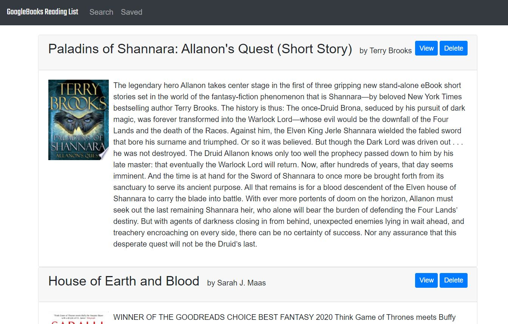

# React GoogleBooks Reading List

  
## Description

  [Deployed Application](https://react-googlebooks-reading-list.herokuapp.com/)
   
   This is a clean and simple React application to keep a personal reading list. It has a built-in GoogleBooks search to provide recommendations based on any keyword provided. Unfortunately, even though a user has a lot of flexibility with their search keyword, the results list is limited to a maximum of 10. So, even if looking for a specific book, more than one keyword might be necessary to actually return the desired result. After searching, a user can choose to save the book, view books on GoogleBooks, and delete from the saved book list. At this time, this application may only be used by one user at a time as there is no user data and books are not saved by any user id.
    
  
  
## Table of Contents
  
  * [Description](#description)
  * [Usage](#usage)
  * [Tests](#tests)
  * [Future](#futureFeatures)
  * [Contributing](#contributing)
  * [License](#license)
  * [Questions](#questions)
    
## Usage
  1. Navigate to [https://react-googlebooks-reading-list.herokuapp.com/](https://react-googlebooks-reading-list.herokuapp.com/).
  1. Click on Search in the navigation bar.
  1. Search for books by any keyword, including author, title, or genre and click the "Search" button.
  1. A list of book results will appear under the search box.
  1. Browse the detailed list and save them to your personal list by clicking the "Save" button.
  1. If you want to see the book in the GoogleBooks store, click the "View" button.
  1. When you are finished searching and saving books, you can view your personal list by clicking the "Saved" link in the navigation bar.
  1. In your personal list, you again have the option of viewing each book in GoogleBooks.
  1. You can also delete books from your reading list by clicking the "Delete" button.
  1. Because your list is saved in a database, it will persist across all browsers and devices.
    
## Tests
  There are no test suites.
## License
  [Apache License](https://choosealicense.com/licenses/apache/)
  
  ## Contributing
  To contribute to this repo:
  1. Fork the repo
  1. Make changes to forked repo
  1. Submit pull request to this repo
  
## FutureFeatures
- Authentication to allow multiple users to search and save books.
- Clear search input field on submit.
- Change search to submit on return.
- Paginate to allow for more than 10 search results.

## Questions
  
  For more information:
  Visit my GitHub: [https://rsowald.github.io](https://rsowald.github.io)

  or Email: renaesowald@gmail.com